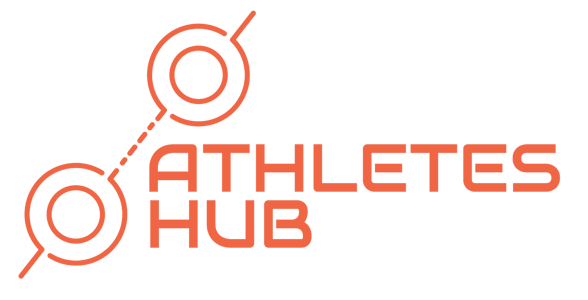

# Athletes-Hub

</img>    

A prototype implementation for the Praxisseminar and MIT Global Startup Labs courses of the University of Regensburg.

## Documentation

Documentation is done via our Github Wiki and our Kanban board on Github.
 - Kanban board: https://github.com/users/ValdrDarmir/projects/8
 - Wiki: https://github.com/ValdrDarmir/Athletes-Hub/wiki

## Development

### Setup

To setup the development environment you need to run `npm install`.

### Available Scripts

In the project directory, you can run the following npm scripts.

#### `npm start`

Runs the app in the development mode.\
Open [http://localhost:3000](http://localhost:3000) to view it in the browser.

The page will reload if you make edits.\
You will also see any lint errors in the console.

#### `npm run build`

Builds the app for production to the `build` folder.\
It correctly bundles React in production mode and optimizes the build for the best performance.

The build is minified and the filenames include the hashes.\
Your app is ready to be deployed!

See the section about [deployment](https://facebook.github.io/create-react-app/docs/deployment) for more information.

#### `npm run deploy`

This will build and push the application to the gh-pages branch.
The application is then reachable under [https://valdrdarmir.github.io/Athletes-Hub/](https://valdrdarmir.github.io/Athletes-Hub/).

### CICD

This project uses Github Actions for its CICD Pipelines. The following features are supported.
- Every Pull Request is checked for a sucessfull build. A PR can only be merged, if it builds sucessfully.
- Every merge into main is built automatically and deployed via Github Pages to the domain [https://valdrdarmir.github.io/Athletes-Hub/](https://valdrdarmir.github.io/Athletes-Hub/).

# Team

All team members are associated with the University of Regensburg.

Team members:
- Niklas Donhauser
- Sabrina Hößl
- Benedikt Strasser
- Christoph Wührl
